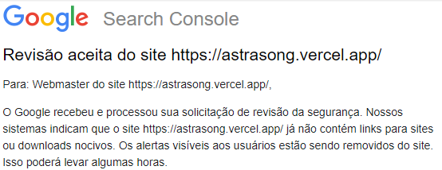
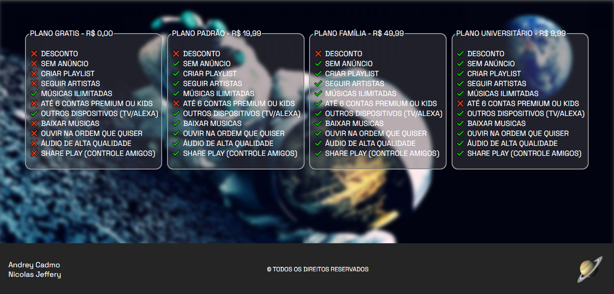

# 🎶 AstraSong - sons de outro mundo 

WebSite desenvolvido para um projeto da Faculdade para apresentar os nosso conhecimentos em HTML, mas aproveitei e apresentei o meu conhecimento em CSS e JavaScript.

### 🌎 Veja o resultado!

Acesse o <a href="https://astrasong.vercel.app/">Website</a> e veja o resultado.   

Revisão feita e o site não é mais considerado perigoso.

### 🎭 Artistas & Sons

- Alliance - Time Eater
- Clemens - Interstellar
- Clemens - Pandora
- Nordwise - Eurasia
- StormSound - Avalon

### 🎬 Demonstração

### ⚒ Linguagens e Ferramentas 

### 🙍‍♂️ Autores

- [@AndreyCadmo](https://github.com/AndreyCadmo)
- [@NicolasJeffery](https://github.com/NicolasJeffery)

